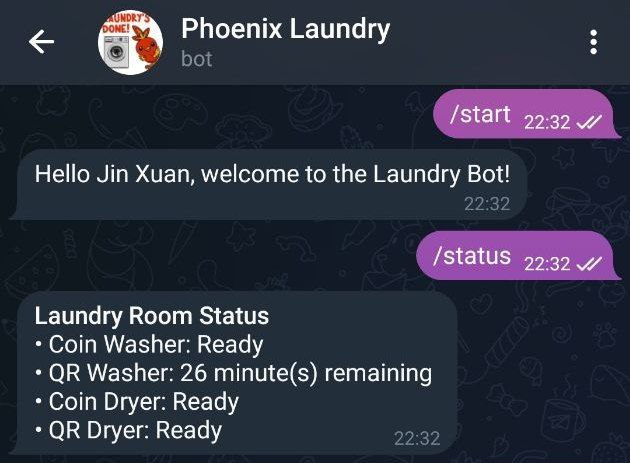
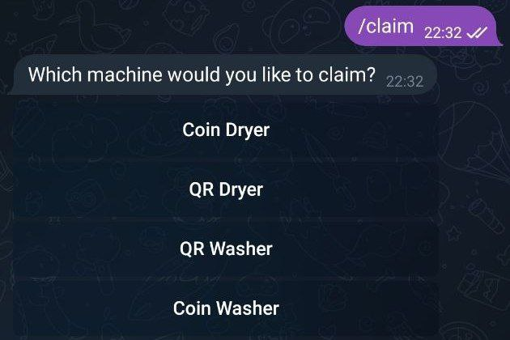
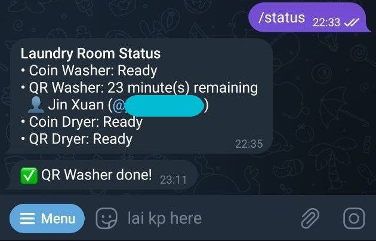
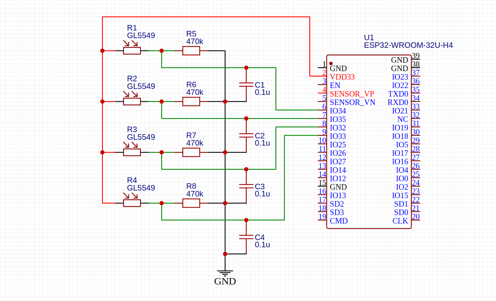

<!-- omit in toc -->
# Phoenix Laundry Bot

<!-- omit in toc -->
## Table of Contents
- [Setup](#setup)
  - [Development Environment](#development-environment)
  - [Dependencies](#dependencies)
  - [Environment Variables](#environment-variables)
- [Documentation](#documentation)
  - [Features](#features)
  - [Bot usage](#bot-usage)
  - [Product Demo](#product-demo)
  - [Hardware setup](#hardware-setup)

## Setup

### Development Environment
- This project requires [PlatformIO](https://platformio.org/) to build the source code and the required dependencies
- We recommend using the PlatformIO extension on Visual Studio Code

### Dependencies 
- This project uses a [modified version](https://github.com/jinxuan-owyong/Universal-Arduino-Telegram-Bot/tree/master) of the Universal Telegram Bot Library (V1.3.0)
- It is automatically cloned into the project by PlatformIO

### Environment Variables 
- The environment variables are stored in the header file `include/Config.h`
- An example can be found at `include/Config.example.h`
- Set `WIFI_CONNECTION_TYPE` to either `WPA2_PERSONAL` or `WPA2_ENTERPRISE`, depending on WiFi network, and the corresponding credentials.
- Generate the Telegram bot token (`BOT_TOKEN`) from [@BotFather](https://t.me/BotFather)
- Set the Telegram group ID to be notified when the machine cycle is complete in `GROUP_ID_PROD`. The bot must also be added into the group.
- For sensor input, only choose GPIO32 to GPIO39 (ADC1), and update `INPUT_DRYER_X` or `INPUT_WASHER_X`

## Documentation

### Features
1. Check the status of the machines /status
2. Subscribe to notifications when the machine cycle is complete using /claim - Select the machine from the inline keyboard
3. Unsubscribe to notifications using /unclaim if the user accidentally claims the wrong machine
4. If the machine finishes its cycle and the machine is not claimed by anyone, the bot will notify the group instead

### Bot usage
| Command   | Description                                        |
| --------- | -------------------------------------------------- |
| `claim`   | Tag a dryer/washer to the user's telegram handle   |
| `help`    | Show the help message                              |
| `start`   | Initialise bot                                     |
| `status`  | Get the status of the laundry room                 |
| `unclaim` | Untag a dryer/washer that you accidentally claimed |

### Product Demo

| Image                                                                 | Description                                                                                                                                                   |
| --------------------------------------------------------------------- | ------------------------------------------------------------------------------------------------------------------------------------------------------------- |
|  | Using `/status`, the user is able to access the real-time status of the laundry machines.                                                                     |
|  | Using `/claim`, the user can choose to subscribe to notifications when the next laundry cycle is complete.                                                    |
|  | The current user's information is made available when another user uses `/status`.  The user also receives a message when the machine cycle is complete. |

### Hardware setup 

